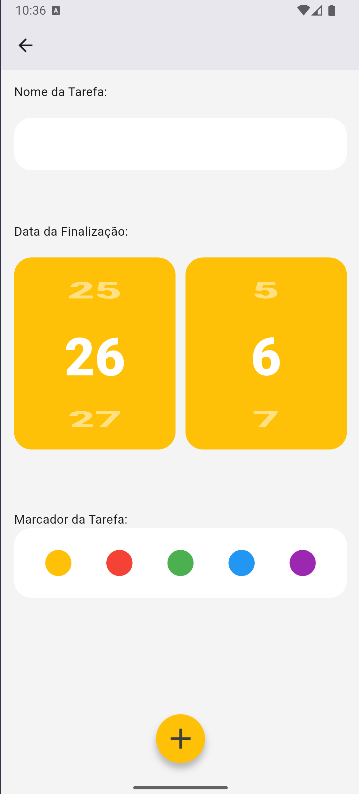

# Lista de Tarefas - Flutter

>[!IMPORTANT]
>Este é um projeto de lista de tarefas desenvolvido com Flutter. O objetivo do aplicativo é permitir 
>que os usuários gerenciem suas tarefas de maneira simples e eficiente. A aplicação permite adicionar, 
>por um marcador de cor, data de finalização e marcar tarefas como concluídas.

## Imagens

### Mockup do Figma
Aqui está o mockup da interface que foi projetado no Figma:


### Prints do App
Abaixo estão dois prints do aplicativo em funcionamento:

1. Tela inicial do aplicativo com a lista de tarefas.

   

2. Tela de criação de tarefa, onde a tarefa pode ter um nome, data, e marcador.

   

## Funcionalidades

- [x] **Adicionar Tarefas**: O usuário pode adicionar novas tarefas à lista.
- [x] **Marcar Tarefas como Concluídas**: O usuário pode marcar uma tarefa como concluída.
- [x] **Por Marcador de cor**: O usuário pode por um marcador de cor tarefas da lista.
- [ ] **Armazenamento Local**: Ainda por adicionar.

## Tecnologias Utilizadas

- Flutter
- Dart

## Como Rodar o Projeto

1. Clone o repositório para o seu computador:

   ```bash
   git clone https://github.com/Herbert-Moreno/Projeto_De_Lista_de_Tarefas.git
   ```

2. Baixar flutter sdk e Dartlang
3. Baixar o Android Studio para conseguir as VM android

3. Abra o projeto no seu IDE
4. Inicie a VM
5. Rode o seguinte comando:
   ```
   flutter run lib/main.dart
   ```
